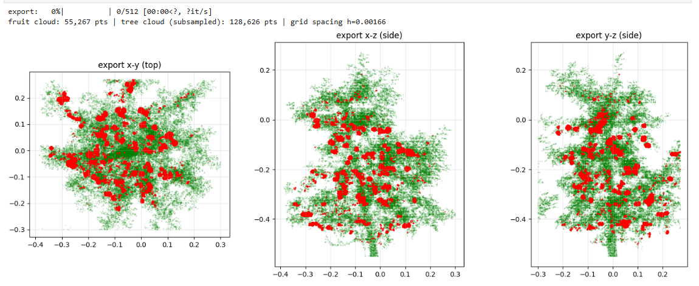
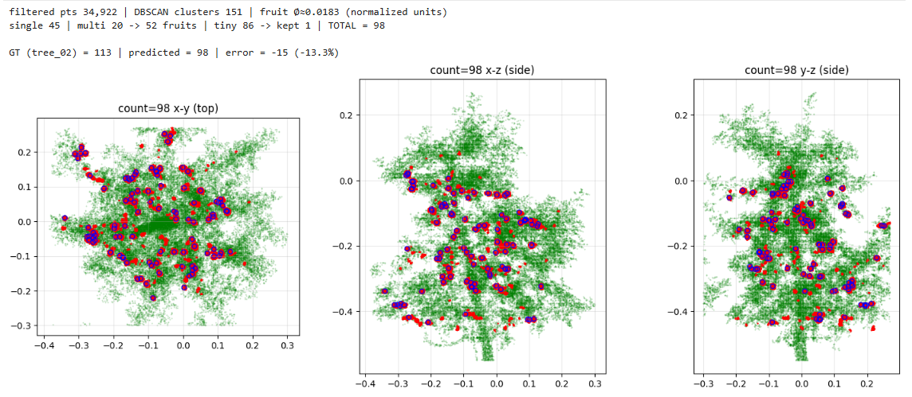
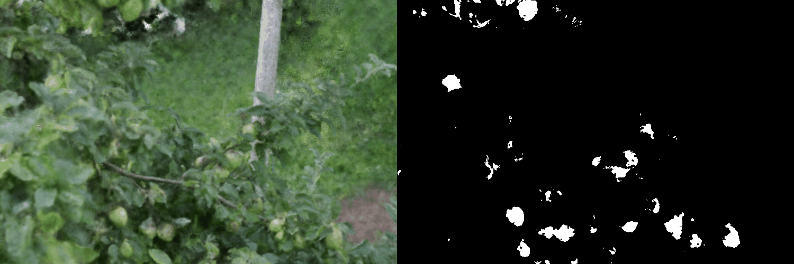

# FruitNeRF-Based Fruit Counting, Independent Implementation

This repository contains my independent research implementation of a FruitNeRF-based fruit counting pipeline. The implementation, experiments, counting logic, project structure, documentation, and result packaging in this repository are my code and research work. The repository is not licensed for reuse, copying, modification, redistribution, commercial use, model training, or derivative work without my prior written permission.

The project was developed using the published FruitNeRF research as the methodological reference. Citation of the original FruitNeRF paper and dataset is included for academic attribution and does not grant permission to reuse the code in this repository.

The public dataset is available from Zenodo at DOI `10.5281/zenodo.10869455`. The dataset contains real and synthetic FruitNeRF data. The real data includes three apple trees and segmentation folders used by the original work.

## What is different from the original FruitNeRF workflow

The supplied notebook is not only a direct invocation of the official Nerfstudio integration. It implements several parts of the pipeline directly in PyTorch and adds experiment specific counting logic. The main differences visible in the notebook are:

1. A standalone PyTorch FruitNeRF style model is implemented in the notebook, including hash grid encoding, proposal networks, semantic prediction, camera optimization, hierarchical sampling, interlevel loss, and distortion loss. It can use tiny-cuda-nn when available and has a pure PyTorch fallback.
2. The notebook includes its own COLMAP reader and conversion path to Nerfstudio style `transforms.json`.
3. Real tree images are downscaled by a factor of four and can be cached in NumPy arrays for faster repeated loading during experiments.
4. Fruit and tree point clouds are exported by dense uniform volume sampling on a `512 x 512 x 512` grid in normalized scene coordinates.
5. The export thresholds are fixed at density `150.0` and semantic probability `0.9`. The notebook states that these values were selected on `tree_02` and then frozen.
6. Counting uses grid spacing to scale radius filtering and DBSCAN parameters. Clusters are divided into tiny, single fruit, and multi fruit groups using convex hull volume relative to a data derived template.
7. Multi fruit clusters are split with agglomerative clustering. The number of fruits is selected by Hausdorff distance to a representative single fruit template, which follows the paper idea but is implemented directly in this notebook.
8. The notebook adds crop box sensitivity checks, projection of predicted fruit centers back into camera images, and nearest neighbor diagnostics.
9. Two extra duplicate handling experiments are included after the main count. One uses connected component merging below `0.6` fruit diameters. A second experimental version uses non chaining suppression and recovery of isolated partial fruit clusters. These are additional post processing experiments and are not used as the main result table below.

## Main results available in the notebook

The table below uses the main count reported by the notebook before the later duplicate correction experiments.

| Tree | Ground truth | FruitNeRF paper count | This implementation | Paper absolute error | This implementation absolute error |
| --- | ---: | ---: | ---: | ---: | ---: |
| tree_01 | 179 | 147 | 168 | 32 | 11 |
| tree_02 | 113 | 86 | 98 | 27 | 15 |

For these two trees, the mean absolute count error is `29.5` for the paper values stored in the notebook and `13.0` for the main counts from this implementation. The count to ground truth ratio is `93.9%` for tree_01 and `86.7%` for tree_02.

The later experimental `v2` counting cell reports `148` for tree_01 and `104` for tree_02. This version improves tree_02 but reduces tree_01, so it is kept separate from the main result. A later rerun also prints a raw tree_02 count of `100` from a stored point cloud. The tree_02 figure and the earlier summary cell report `98`. The saved run artifacts should be checked to resolve this small rerun discrepancy before publication.

## tree_02 point cloud export



The green points are the tree cloud and the red points are fruit points after thresholding the learned field. The three panels show top and side projections.

## tree_02 fruit count



The shown run reports `98` predicted fruits for a ground truth count of `113`, an error of `-15`, or `-13.3%`.

## tree_01 RGB and segmentation result

The animation below shows the tree_01 RGB view alongside its fruit segmentation mask. The left side contains the source image sequence and the right side shows the corresponding binary fruit segmentation.



## Repository layout

```text
fruitnerf_reimplementation/
  configs/
    frozen_counting_params.json
    tree_01.json
    tree_02.json
  data/
    README.md
    external/
    raw/
    processed/
  notebooks/
    fruit1_original.ipynb
  outputs/
  results/
    images/
      tree_01/
      tree_02/
    gifs/
      tree_01/
        tree_01_side_by_side.gif
    metrics/
      tree_01.json
      tree_02.json
  scripts/
    notebook_export.py
    count_from_cloud.py
    summarize_results.py
  src/fruitnerf_repro/
    config.py
    counting.py
    results.py
  tests/
  CITATION.cff
  LICENSE
  THIRD_PARTY_NOTICE.md
  pyproject.toml
  requirements.txt
```

## Data setup

Download the real dataset from Zenodo and extract it under `data/external/FruitNeRF_Real/`. The large dataset is intentionally ignored by Git. The expected tree folder layout is documented in `data/README.md`.

## Python setup

```bash
python -m venv .venv
source .venv/bin/activate
pip install -U pip
pip install -e .
```

For the exact experiment implementation, open `notebooks/fruit1_original.ipynb`. The file `scripts/notebook_export.py` is a cell ordered Python export for code review and version control.

To summarize the stored comparison results:

```bash
python scripts/summarize_results.py
```

To rerun the cleaned counting stage from an exported cloud file:

```bash
python scripts/count_from_cloud.py path/to/clouds.npz
```

## Additional experiment artifacts

For a more complete reproducible release, add the saved outputs for each evaluated tree under `outputs/` or `results/`. Useful artifacts include `count.json`, training logs, saved run configuration, selected render PNG files, `clouds.npz`, `fruit_clusters.ply`, `fruit_centers.ply`, and the final checkpoint. Large artifacts should normally be stored with Git LFS, a GitHub release, or Zenodo rather than normal Git history.

For the README, two or three representative RGB images with their SAM segmentation masks for tree_01 and tree_02 would also document the segmentation input stage.

## Copyright and use restrictions

Copyright (c) 2026 Repository Author. All rights reserved.

The source code, notebooks, scripts, configuration, documentation, figures produced by this implementation, and project organization in this repository are provided for viewing and academic reference only. No permission is granted to use, copy, modify, merge, publish, distribute, sublicense, sell, train models on, or create derivative works from this repository without prior written permission from the copyright holder. See `LICENSE` for the full terms.

## Research reference

This work implements and extends ideas described in **FruitNeRF: A Unified Neural Radiance Field based Fruit Counting Framework** by Lukas Meyer, Andreas Gilson, Ute Schmid, and Marc Stamminger. The FruitNeRF paper and public dataset are cited as research references. The dataset remains subject to its own terms and is not redistributed by this repository.

`THIRD_PARTY_NOTICE.md` records external research, datasets, and software dependencies that retain their own rights and license terms.

Important publication check: the restrictive license applies to code that you own. If any file contains source code copied or adapted from a third party repository, that portion must continue to follow the applicable third party license.
